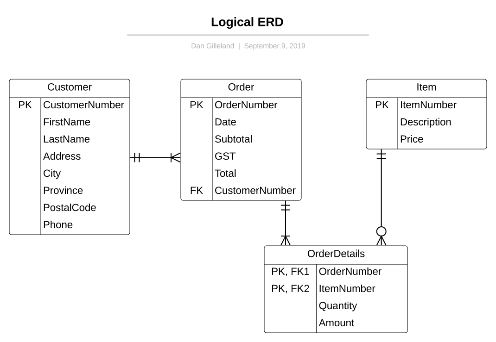

# Normalization

:::warning
Draft Content
:::

## Zero Normal Form

While Zero-Normal Form (**0NF**) isn't regarded by most as an official step, it's nonetheless crucial. The whole goal of this phase is to *identify all the attributes* of your entity. In the process of doing this, it's vital that you make sure

- your attributes are in their *atomic* form (the smallest, most meaningful information),
- you have clearly identified the *repeating groups* somehow (such as putting them inside curly braces),
- you have identified what attribute is acting to *uniquely identify* the entity as a whole (usually it's a single attribute), and
- you have given a name to your entity

<!--
1. Give a name to the complete form (this is our core entity)
2. List all the metadata as atomized attributes
3. Identify the unique primary key attribute
4, Identify which attributes represent a set of repeating data
-->

## First Normal Form

First Normal Form (**1NF**) is all about *separating out **repeating groups*** of information.

If you found some repeating groups of data in 0NF, then this is the step where you separate out that repeating information into a new entity. If there are no repeating groups of data, then just state `No Changes` for this step.

To document the 1NF changes, do the following:

1. Rewrite your 0NF entity ommiting the repeating data
2. Make a copy of the Primary Key attribute from the 0NF entity and place it as the first attribute in the new entity that we are creating. This will be our foreign key to the original entity.
3. List the repeating group's attributes in our new entity.
4. Identify the attribute(s) of the repeating group which act to uniquely identify that repeating group; pair that attribute with the foreign key to produce a composite primary key for the new entity.
5. Give the new entity a name.

## Second Normal Form

Second Normal Form (**2NF**) is all about *separating out **partial dependencies***.

1. Examine an entity with a composity key, and identify which non-primary key attributes have a dependency on only *part* of the composite primary key. These are the attributes that will form our new entity.
2. Re-write the original entity without those partially dependent attributes.
3. *Copy* down the partial primary key attribute to the new entity; make it the new entity's primary key.
4. Add the partially dependent attributes to the new entity.
5. Mark the partial primary key attribute in the original entity as a foreign key to our new entity.

## Third Normal Form

Third Normal Form (**3NF**) is all about *separating out **transitive dependencies***.

1. Examine all previous entities and look for any "hidden" or "embedded" entities inside the non-primary key attributes. At the same time, see if you can find which attribute uniquely identifies the set of embedded attributes inside that entity.
2. Separate out this set of attributes representing the embedded entity by making it a distinct entity in its own right. Give this entity a name; be sure to identify this new entity's primary key.
3. Re-write the original entity, and be sure to retain the attribute that identifies the newly generated entity; this will be your foreign key to that new entity.

## Keeping it all Straight

A key part of walking through the normalization steps is to **be consistent**.

- When you give an entity a name, *keep that same name* each time you modify the list of attributes in that entity.
- When you name your attributes in **0NF**, *key the same names* for these attributes. If you are placing those attributes in a new entity, *do **not*** rename the attributes.
- ***Never*** change the primary key from a previously established entity. (*Note: There are some exceptions to this rule, but as a beginner, changing a primary key is a strong indicator that you're doing it wrong.*)
- *Never* change the foreign keys from previously established entities when re-writing them as modified entities.
- Always self-check the relationship between your entities at each step of the normalization process. Make a quick note of the one-to-many relationships that should form as you create new entities at each step; the cardinal relationship between the entities should make sense.

## A Simple Example

Imagine a form that looks like this:

### 0NF - Identifying Metadata

**Entity:** (<b class="pk">OrderNumber</b>, Date, CustomerNumber, FirstName, LastName, Address, City, Province, PostalCode, Phone, <b class="rg">ItemNumber, Description, Quantity, Price, Amount</b>)

### 1NF - Repeating Groups

### 2NF - Partial Dependencies

### 3NF - Transitive Dependencies

### ERD

## A Complex Example

----

