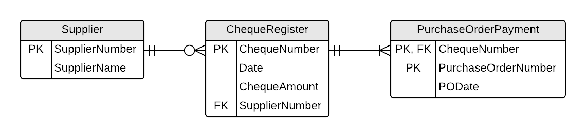

# ESP Document 4 - Payments to Suppliers

## Cheque Register

The Cheque Register and its resulting tables are based on the following form (taken from the original documentation).

This form was analyzed according to the rules of 0NF (Zero-Normal Form), 1NF (First-Normal Form), 2NF (Second-Normal Form), and 3NF (Third-Normal Form).

### 0NF

After performing Zero-Normal Form, a single table was generated: **ChequeRegister**.

**ChequeRegister** (<b class="rg">{</b>Date, ChequeNumber, ChequeAmount, SupplierNumber, SupplierName, <b class="rg">{</b>PurchaseOrderNumber, PODate<b class="rg">}</b> <b class="rg">}</b>)

> Note that there are two sets of repeating groups - one within the other. Also note that there is nothing outside of both repeating groups. When there is no information outside of all the repeating groups, and there is only one outermost repeating group, you can effectivly ignore that as a repeating group; the outermost curly braces become a lot like extra parenthesis in an arithmetic expression: `(2 * (3 + 4))` is the same as writing `2 * (3 + 4)`.

**ChequeRegister** (<b class="pk">ChequeNumber</b>, Date, ChequeAmount, SupplierNumber, SupplierName, <b class="rg">{</b>PurchaseOrderNumber, PODate<b class="rg">}</b>)

### 1NF

After performing First-Normal Form, a single table was generated: **PurchaseOrderPayment**.

**ChequeRegister** (<b class="pk">ChequeNumber</b>, Date, ChequeAmount, SupplierNumber, SupplierName)

**PurchaseOrderPayment** (<b class="pk"><u class="fk">ChequeNumber</u>, PurchaseOrderNumber</b>, PODate)

### 2NF

After performing Second-Normal Form, a single table was generated: **PurchaseOrder**.

**PurchaseOrderPayment** (<b class="pk"><u class="fk">ChequeNumber</u>, <u class="fk">PurchaseOrderNumber</u></b>)

**PurchaseOrder** (<b class="pk">PurchaseOrderNumber</b>, PODate)

### 3NF

After performing Third-Normal Form, a single table was generated: **Supplier**.

**ChequeRegister** (<b class="pk">ChequeNumber</b>, Date, ChequeAmount, <u class="fk">SupplierNumber</u>)

**Supplier** (<b class="pk">SupplierNumber</b>, SupplierName)

### ERD

