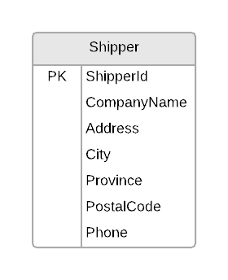
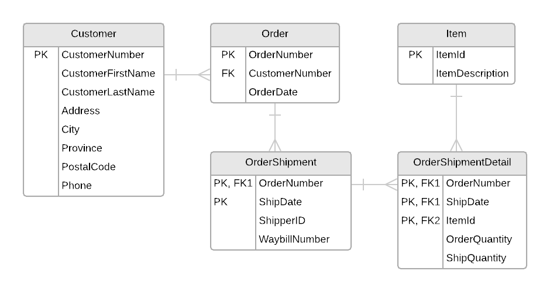

# ESP Document 5

## Shippers Details View

### 0NF

**Shipper:** (<b class="pk">ShipperNumber</b>, CompanyName, Address, City, Province, PostalCode, Phone)

### 1NF – 3NF

No changes to the table in 1NF to 3NF.

### ERD

The following ERD represents the tables/entities from the Shipper Details View.

## Order Shipment View

### 0NF

**Order:** (<b class="pk">OrderNumber</b>, CustomerFirstName, CustomerLastName, CustomerNumber, Address, City, Province, PostalCode, Phone, OrderDate, <b class="rg">{ <b class="rg">{</b></b>ItemId, ItemDescription, OrderQuantity, ShipQuantity<b class="rg">}</b>, ShipperId, WaybillNumber, ShipDate<b class="rg">}</b>)

### 1NF

**Order:** (<b class="pk">OrderNumber</b>, CustomerFirstName, CustomerLastName, CustomerNumber, Address, City, Province, PostalCode, Phone, OrderDate)

::: tip Note
When looking at the outermost repeating group, it might be tempting to take the `ShipperId` as part of the new composite key, but a closer look at the form's data reveals that a combination of `ShipperId` and `OrderNumber` would not produce a unique key.

We are told, however, that "At most, *each customer will get a single shipment in a day.*" That means, for each outer group of repeating items, the `ShipDate` is the best candidate for pairing with the `OrderNumber` to produce a primary key.
:::

**OrderShipment:** (<b class="pk"><u class="fk">OrderNumber</u>, ShipDate</b>, ShipperId, WaybillNumber)

**OrderShipmentDetail:** (<b class="pk"><u class="fk">OrderNumber, ShipDate</u>, ItemId</b>, ItemDescription, OrderQuantity, ShipQuantity)

### 2NF

**OrderShipmentDetail:** (<b class="pk"><u class="fk">OrderNumber, ShipDate</u>, <u class="fk">ItemId</u></b>, OrderQuantity, ShipQuantity)

**Item:** (<b class="pk">ItemId</b>, ItemDescription)

### 3NF

**Order:** (<b class="pk">OrderNumber</b>, <u class="fk">CustomerNumber</u>, OrderDate)

**Customer:** (<b class="pk">CustomerNumber</b>, CustomerFirstName, CustomerLastName, Address, City, Province, PostalCode, Phone)

::: tip Note
For the **OrderShipment**, it would be tempting to associate the `WaybillNumber` with the `ShipperId` as a transitive dependency. However, the specifications said that we are not interested in managing waybill numbers for each shipper, so we will keep these attributes where they are.

**OrderShipment:** (<b class="pk"><u class="fk">OrderNumber</u>, ShipDate</b>, ShipperId, WaybillNumber)
:::

### ERD

----

## (Alternate) Order Shipment View

> In this *alternate* **Order Shipment View**, we are actually recording the `WaybillNumbers` for each shipper. That can be realistic *only if* the waybill numbers from shippers are unique (that is, no two shippers can use the same waybill number for their shipments). If we are generating our own waybill numbers on the forms, then the following normalization would be a valid solution.

### 0NF

After performing Zero-Normal Form, a single table was generated: **Order**

**Order**: (<b class="pk">OrderNumber</b>, CustomerFirstName, CustomerLastName, CustomerNumber, Address, City, Province, PostalCode, Phone, OrderDate, <b class="rg">{</b> <b class="rg">{</b> ItemId, ItemDescription, OrderQuantity, ShipQuantity<b class="rg">}</b> , ShipperId, WaybillNumber, ShipDate<b class="rg">}</b>)

### 1NF

After performing First-Normal Form, two additional tables were generated: **OrderShipment** and **OrderShipmentDetail**

**Order**: (<b class="pk">OrderNumber</b>, CustomerFirstName, CustomerLastName, CustomerNumber, Address, City, Province, PostalCode, Phone, OrderDate)

**OrderShipment**: (<b class="pk"><u class="fk">OrderNumber</u>, WaybillNumber</b>, ShipperId, ShipDate)

**OrderShipmentDetail**: (<b class="pk"><u class="fk">OrderNumber, WaybillNumber</u>, ItemId</b>, ItemDescription, OrderQuantity, ShipQuantity)

### 2NF

After performing Second-Normal Form, two additional tables were generated: **Waybill** and **Item**.

**OrderShipment**: (<b class="pk"><u class="fk">OrderNumber</u>, <u class="fk">WaybillNumber</u></b>)

**Waybill**: (<b class="pk">WaybillNumber</b>, ShipperId, ShipDate)

**OrderShipmentDetail**: (<b class="pk"><u class="fk">OrderNumber, WaybillNumber</u>, <u class="fk">ItemId</u></b>, OrderQuantity, ShipQuantity)

**Item**: (<b class="pk">ItemId</b>, ItemDescription)

### 3NF

After performing Third-Normal Form, an additional table was generated: **Customer**

**Order**: (<b class="pk">OrderNumber</b>, <u class="fk">CustomerNumber</u>, OrderDate)

**Customer**: (<b class="pk">CustomerNumber</b>, CustomerFirstName, CustomerLastName, Address, City, Province, PostalCode, Phone)

### Final Tables

**Order**: (<b class="pk">OrderNumber</b>, <u class="fk">CustomerNumber</u>, OrderDate)

**Customer**: (<b class="pk">CustomerNumber</b>, CustomerFirstName, CustomerLastName, Address, City, Province, PostalCode, Phone)

**OrderShipment**: (<b class="pk"><u class="fk">OrderNumber</u>, <u class="fk">WaybillNumber</u></b>)

**Waybill**: (<b class="pk">WaybillNumber</b>, ShipperId, ShipDate)

**OrderShipmentDetail**: (<b class="pk"><u class="fk">OrderNumber, WaybillNumber</u>, <u class="fk">ItemId</u></b>, OrderQuantity, ShipQuantity)

**Item**: (<b class="pk">ItemId</b>, ItemDescription)

### ERD

<!-- -->
